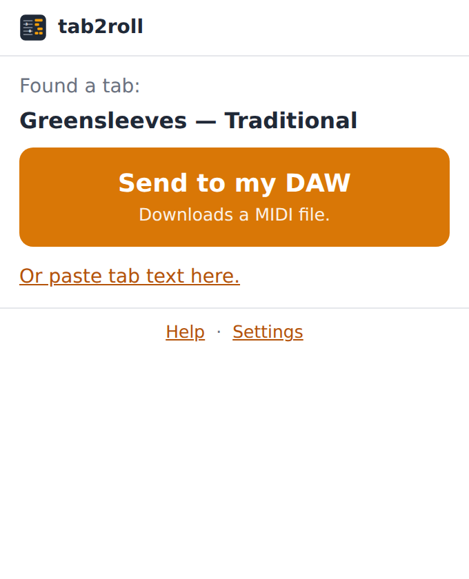
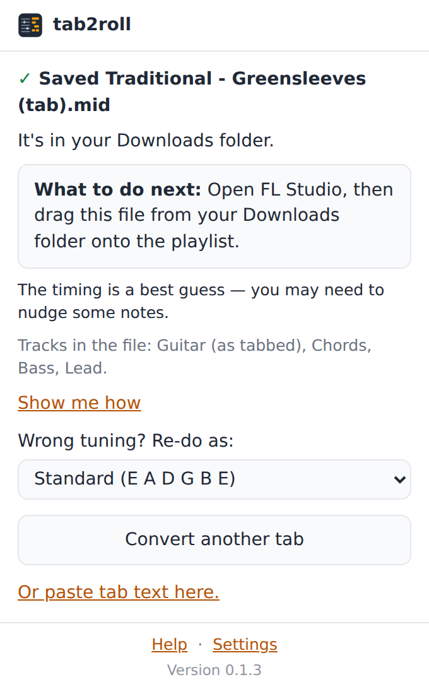

# tab2roll

A Firefox extension that turns the guitar tab on the page you are looking at into a
standard MIDI file you can open in your DAW.

- One button: **Send to my DAW**. The file lands in your Downloads folder as
  `Artist - Song (tab).mid`.
- Works on Ultimate Guitar and on any page that shows tab or chords as text, including
  modern chord pages that print the chord names above (or on their own line before) the
  words. If a page can't be read, paste the text into the popup instead.
- **Reads tab that is drawn rather than written.** The "Official" and "Pro" tabs and the
  interactive players paint the music onto a canvas — there is no tab text on those pages
  at all — so tab2roll reads the picture: it finds the strings, reads the fret numbers off
  them and shows you the tab it made before saving anything. Drop or paste a screenshot or
  a photo of a page and it does the same.
- **Reads the whole song, not just what fits.** A player only draws the bars on screen, so
  one click reads one screenful. "Read the whole song" scrolls the page a staff at a time,
  reads each screenful, joins them up and puts the page back where it was.
- Reads the song out of the page and leaves the rest behind: navigation, the
  chord-diagram legend, comments and the A-Z artist index never become bars of music.
- Makes up to four tracks: the guitar exactly as tabbed, plus chords, bass and lead
  worked out from it. A checkbox beside the button turns those three off when you want
  the guitar alone; the info icon next to it says what they are.
- Zero network requests, no accounts, no telemetry. It reads the page you clicked on and
  writes one file. That's all.




## Try it (development)

```sh
npm test            # unit tests + golden files + popup smoke test (Node 22+)
npm run dev         # web-ext run: opens Firefox with the extension loaded
npm run lint        # web-ext lint
npm run build       # regenerate src/extract/injected.js (see below)
```

`npm run dev` and `npm run lint` use `npx web-ext`, which is fetched on demand; nothing
in this repository has runtime dependencies and the tests need only Node.

To load it by hand: open `about:debugging#/runtime/this-firefox`, choose **Load
Temporary Add-on…** and pick `src/manifest.json`. The onboarding page opens on first
install and shows how to pin the toolbar button.

### Convert a tab file from the command line

```sh
node tools/convert.js test/fixtures/ode-to-joy.txt out.mid
node tools/convert.js my-tab.txt --tuning drop-d --step 1/16 --notes
node tools/convert.js my-tab.txt out.mid --no-split-sections
node tools/convert.js screenshot.png out.mid --show-tab
```

This is how the parser was developed and verified before any browser code existed; it
prints a summary (title, tuning, tracks, timing step) and with `--notes` every note.

Hand it a PNG and it reads the sheet music off it first, exactly as the extension does,
reporting how sure it is; `--show-tab` prints the tab it made of the picture.

## How it works

```
src/
  extract/      DOM  -> raw tab text        runs inside the page; site-specific
                DOM  -> pixels              score-canvas.js, for pages that draw it
  read/         picture -> ASCII tab text   pure, no DOM (see below)
    stitch.js   screenfuls -> one tab        which staves are whole, how far to scroll
  parse/        text -> IR                  pure, no DOM, no browser APIs
    region.js   whole page -> just the song (see below)
    sections.js the song's callouts -> parts  (see below)
  arrange/      IR   -> IR + chord/bass/lead pure
    sections.js IR   -> one track per part
  midi/         IR   -> Uint8Array          pure, hand-written SMF encoder
  pipeline.js   the three above in one call (used by the CLI and the extension)
  background.js event page: runs the pipeline, saves the file, opens onboarding
  ui/           popup, onboarding, help and settings pages (plain HTML + JS)
    picture.js  the popup's side of reading a picture
  strings.js    every user-facing string
test/
  fixtures/     tab texts + golden files (see test/fixtures/README.md)
    pictures/   PNGs of tab + the tab each was drawn from
  helpers/draw.js  draws tablature, in a digit face the reader has never seen
.github/
  workflows/ci.yml  runs the suite and web-ext lint on every pull request
tools/
  convert.js    CLI (text or PNG in, MIDI out)
  png.js        a PNG reader, so the CLI can be pointed at a screenshot
  build-injected.js  builds the one script that runs inside web pages
  make-pictures.js   draws the picture fixtures
  update-goldens.js  regenerates the golden files
```

`parse/`, `arrange/` and `midi/` are plain ES modules with no dependencies, so they run
under Node and in the browser unchanged. Timing in ASCII tab is always a guess; the
guesses and how to tune them are written up in [docs/musical-decisions.md](docs/musical-decisions.md).

### The one script that runs inside a web page

Clicking the toolbar button grants `activeTab`; the popup then injects
`src/extract/injected.js` into the page with `scripting.executeScript`. That file is
**generated** by `npm run build` from `src/parse/tabshape.js` (the shared tab-shape
heuristic) and `src/extract/sites/*.js`, so the same functions can be unit tested as
ES modules while the injected script stays a single self-contained, import-free
function. It reads the DOM and returns plain data; it injects no UI, keeps no state and
never touches the network. The generated file is committed so a checkout loads without
a build; `npm test` fails if it is stale.

There is one exception to "reads and returns", and it is deliberately not in that file.
"Read the whole song" scrolls the page, which means changing it. That code lives in
`popup.js` as `SCROLL_SCORE`, injected as a function on its own, only when the user presses
that button, and it does nothing but scroll and wait for a repaint. The popup puts the page
back where it found it when the reading is done, including when it fails — the one case it
cannot cover is the popup being closed part-way through, since that is the code doing the
putting back.

### Reading sheet music

An "Official" or "Pro" tab page has no tab text on it anywhere — not in the DOM, not in a
script tag, not in an attribute. The music is painted onto a `<canvas>`, so the notes exist
only as pixels. `src/read/` reads them:

```
picture -> ink            image.js   grey, then black and white, either way up
        -> staves         staff.js   the long even lines, and how they group
        -> marks          glyphs.js  lines rubbed out, what is left picked up
        -> digits         digits.js  which mark is which
        -> notes and bars score.js   which string, which fret, played together?
        -> tab text       ascii.js
```

The last step is the point of the design: the reader's job ends when the picture has become
the same ASCII tab a person would have pasted in. Everything downstream — the timing
guesses, the tunings, the arranger, the MIDI encoder — is the code that was already there
and already tested. It is also what the user sees, because a picture read slightly wrong is
a mystery until you can look at it, and a 7 that should be a 1 takes five seconds to fix in
a box of dashes.

Three decisions worth knowing about:

- **Tablature only.** Fret numbers on strings, four to seven of them. An ordinary five-line
  stave is recognised as notation and reported as such rather than guessed at: pitches from
  noteheads, clefs, key signatures and accidentals is a different problem, and a wrong
  answer would be worse than an honest "I can't read this".
- **No machine learning, no dependencies.** A printed digit is one of the most constrained
  shapes there is: ten possibilities, upright, at a known size. Four measurements settle it
  — how far the strokes sit from a drawn letterform in `digits.js`, where the strokes fall
  band by band, how many holes it has, and how wide it is for its height. `npm test` reads
  every digit at eight sizes and three widths in a face those letterforms deliberately do
  not match.
- **What it will not do.** It never says a note it is unsure of. Marks it cannot make out
  are counted and reported, both in the popup and by `--show-tab`; the timing still comes
  from the spacing along the page, which is the same guess ASCII tab forces anyway.

Most of what is on a tab player's page is not music — the word TAB down the front of the
staff, a time signature, bar numbers, the H and P of hammer-ons and pull-offs with their
slurs, vibrato squiggles, the rhythm beamed underneath, the player's own cursor — and each
of those is kept out by a rule about where and how big a fret number is, written up in
[docs/musical-decisions.md](docs/musical-decisions.md). A note held over from the bar
before, written in brackets, comes through as the ghost note written tab already means by
`(7)`. `test/fixtures/pictures/player-page.png` has the lot of it in one picture.

#### One screenful, or the whole song

A canvas holds the bars that are on screen and no more, so one click reads one screenful of
a four-minute song. The popup says how much of the score that was, and offers two ways to
get the rest.

**Read the whole song** walks the page: look, scroll, look again, all the way down. Two
pieces of arithmetic make it work, both in `src/read/stitch.js` and both testable without a
browser:

- **Which staves are whole.** A staff running off the bottom of the screen is the dangerous
  one: six lines cut down to four still group as a staff — a bass, to look at it — and would
  come back as music nobody played, on strings the guitar does not have. So a staff is kept
  only when a whole line spacing of clear picture was found below its last line. That
  number is not a guess: staff lines are evenly spaced, so a clear spacing with no line in
  it means the staff really did end there, and less than one means the next line could be
  sitting just off the screen. The top edge is deliberately *not* trimmed — see below.
- **How far to scroll.** Just past the bottom of the last whole staff, converted from
  picture pixels into the page's own with the scale each reading carries (`cssPerPixel`: a
  canvas knows it from where it sits on screen against how big its buffer is). That lands
  the next staff hard against the top of the next picture, which is exactly why the top
  edge is left alone: trimming there would throw away the bars the scroll was made to
  reach, every time, all the way down.

Nothing is read twice and nothing on the fold is lost, so the screenfuls join by
concatenation with no overlap to reconcile. A screenful identical to the one before it is
dropped as a page that did not move, and the walk stops when the scroller reports it is at
the end, when it will not move, or after forty screenfuls, whichever comes first.

**Or by hand**, which is still there and still works: scroll the page yourself, open
tab2roll again, and click "Join this onto what I read before".

#### Getting at the pixels

A canvas does not always hand its pixels over, and a tab player is exactly the kind of page
that will not. A canvas drawn through WebGL has no 2d context to read. One whose control
has been passed to a worker (`transferControlToOffscreen`) has no pixels in the page at
all. One holding another site's images may not be read. All three throw or answer null, and
all three used to look identical to "this page has no music on it".

So there are two routes to the same pixels, tried in that order:

1. **The canvas itself**, via `getImageData`. Exactly what was drawn, at whatever
   resolution the page drew it. Nothing is better when it works.
2. **A photograph of the window**, via `tabs.captureVisibleTab`, cropped to where the
   canvas is on the screen. This holds whatever the person is looking at, however the page
   drew it — WebGL, a worker, or an `` the page swapped in — because it is a picture
   of the screen rather than a copy of a buffer.

`score-canvas.js` decides which: every canvas it passes over is recorded with a reason
(`no-2d-context`, `transferred`, `blocked`, `blank`, `tiny`…), and the ones whose pixels
are out of reach but which are still on the screen come back as `shots` — a rectangle in
CSS pixels, plus the size of the window they were measured in. The popup takes one
photograph, cuts each rectangle out of it and reads it with the same `src/read/` pipeline.

The photograph arrives at the screen's own resolution, which is twice the page's own
measurements on an ordinary laptop, so the scale is worked out from the picture that
arrived (`cropBox` in `src/ui/picture.js`) rather than from `devicePixelRatio`. It is a
PNG, not a JPEG: a JPEG's smudges around a small `7` are exactly what turns it into a `1`.
No permission is added for any of this — `activeTab`, granted by the click that opens the
popup, is what `captureVisibleTab` needs, and the photograph is cropped, read and dropped
without being stored or sent anywhere.

The reasons are not only for the code. They go to the console on every click as
`seen.canvasSkipped`, because "there is a score here I am not allowed to read" and "there
is no score here" want opposite answers from whoever is looking into it.

### When a real page does not work

Every click logs one line to the extension's console saying what the page
looked like: which extractor build is running, how much text was on the page,
and how many lines of it read as tab, chords or words. Open it from
`about:debugging#/runtime/this-firefox` with **Inspect** next to tab2roll.

```
[tab2roll] reading tab 7 https://tabs.ultimate-guitar.com/tab/...
[tab2roll] ran the extractor: frames: 1, { hasResult: true, error: none }
[tab2roll] page: { ok: true, site: "ultimate-guitar", strategy: "pre",
                   build: "45a1e21d", chars: 8213, chordLines: 42 }
[tab2roll] read as: chords { staves: 0, chords: 57, ... }
```

`build` is a hash of the whole injected script, printed by `npm run build`,
and the popup footer shows the installed version. If either does not match,
the browser is running an older copy: reload the add-on.

The first line names the tab being read. If it is not the tab page you are
looking at, that is the whole problem: the popup reads whichever tab is
active, so an extension page or a newly opened tab in front of it will be
read instead. Extension and `about:` pages are skipped without injecting,
because Firefox blocks content scripts there and reports it as an entry
carrying an error rather than as a failure.

`hasResult: false` means the browser ran the script but did not hand its
value back. Firefox does this for file injections, so the answer is fetched
with a second, function-based injection instead; the next console line
reports whether that worked.

On a page that draws its tab, `canvases` is how many canvases gave up their
pixels and `canvasSkipped` says what happened to the rest:

```
[tab2roll] page: { ok: false, reason: "unsupported", type: "official",
                   canvases: 0, canvasSkipped: "1486x1870 blank, 1486x1870 no-2d-context" }
[tab2roll] read a photograph of the window: { ok: true, staves: 6, notes: 42 }
```

`canvases: 0` with nothing in `canvasSkipped` means the page really has no
canvas on it — a different page, or one that has not finished loading.
`canvases: 0` with `no-2d-context`, `transferred` or `blocked` means the
music is there but the buffer is shut, and the next line says how the
photograph of it went. `blank` on its own is usually a player that has not
painted yet: give the page a moment and click again.

To check a page without the extension at all, paste the contents of
[tools/page-check.js](tools/page-check.js) into the console of the tab page
itself. It reports the same numbers plus the first 40 lines as the page reads
them, which is the quickest way to tell "the page is unreadable" from "the
extension is stale".

### When FL Studio ignores the file

A dropped file that FL Studio refuses looks exactly like a broken file: nothing appears,
and no message is shown. It is worth checking the file itself before believing that,
because the answer is usually the drop and not the bytes:

```sh
node tools/check-midi.js out.mid            # or: npm run check-midi -- <file>
```

It re-reads the bytes strictly and without any of the encoder's assumptions — every chunk
length has to be consumed exactly, every track has to end with an end-of-track event, no
note may be left switched on — and prints the tracks, notes and channels it found. A file
that passes is one every DAW can open, and the report says so in as many words, because
the point of running it is to stop suspecting the file.

FL Studio then turns a dropped file down silently in three known cases, none of which
have anything to do with the file:

- It is running as an administrator on Windows. Windows will not let an ordinary file
  window hand files to an elevated program, so the drop never reaches FL Studio
  ([Image-Line knowledge base](https://support.image-line.com/action/knowledgebase/?ans=571)).
- It is the Fruity Edition, which does not accept files dropped on the playlist at all.
- The file's full name and folder run past about 256 characters
  ([Image-Line forum](https://forum.image-line.com/viewtopic.php?t=196376)).

`File > Import > MIDI file` works in every edition and is unaffected by all three, so
that is the route the popup and the help page lead with; dragging is offered as the
shortcut it is. The help page's "Nothing happens when I drag the file in" section
(`ui/help.html#drag-does-nothing`, linked straight from the confirmation in the popup)
says the same thing to users.

### Permissions

`downloads`, `activeTab`, `scripting`. No host permissions: the install prompt does not
warn about reading data on websites, because the extension can only read the page the
user clicked the button on. Settings and the "you just saved…" reminder use the
extension's own `localStorage`, which needs no permission.

## Continuous integration

`.github/workflows/ci.yml` runs the whole suite on every pull request, on both Node
versions still in long-term support — 22, the oldest `package.json` claims to support,
and 24, the current one — plus `web-ext lint`, the same validator AMO runs on
submission. Nothing here runs on Node in the end: `src/` imports no `node:` builtin at
all, because the extension runs in Firefox. What the matrix is really checking is that
the tests, the CLI and the build scripts work on the Node versions `engines` promises,
which is a promise worth keeping true — the first CI run found that `npm test` had never
worked on the floor it claimed at the time. There is nothing to install: the extension has no
dependencies, so `npm test` runs on the standard library alone. The suite also checks
that `src/extract/injected.js` matches the sources it is generated from and that every
golden file still matches what the parser makes of its fixture, so a stale generated
file or an unreviewed parser change fails the build.

A workflow does not gate merges by itself. To make it one, go to **Settings → Branches**
(or **Rules → Rulesets**) for `main`, turn on *Require status checks to pass before
merging*, and select the `test (node 22)` and `test (node 24)` checks.

## Submitting to AMO

- Set a real add-on id in `src/manifest.json` (`browser_specific_settings.gecko.id`);
  it is `tab2roll@placeholder.invalid` until then.
- The only generated file is `src/extract/injected.js`. When uploading, include the
  repository as source and point reviewers at `npm run build`; the tests check that the
  committed file matches the build.
- Package with `npx web-ext build --source-dir src`.

### The parts of the song

Almost every tab says where its parts begin, and almost none of them say it the same
way:

```
[Intro/Verse]        Chorus:        -- Guitar solo --        CHORUS        Estribillo
```

`parse/sections.js` finds those callouts and `parse/index.js` hangs them on the beats the
staves underneath landed on, so the IR carries `sections: [{ name, start, end }]`. Every
file gets a MIDI marker at each one — that is where `[Chorus]` ends up visible along a
DAW's ruler — and the tabbed track is cut at those boundaries, so the chorus is a track
you can loop and the bridge is one you can drag elsewhere. Only the tab itself is cut:
the chords, bass and lead the arranger invents stay whole underneath, because a six-part
song split four ways is twenty-four tracks and worse to open than the one it replaced.
`--no-split-sections` (Settings: "Make a track for each part of the song") turns it off
and gives you the one long track.

The hard part is that there is no agreed spelling, no agreed layout and no agreed
language, so a keyword list cannot be the mechanism — it is only a bonus. What carries it
is shape and position: a short line, on its own, with music starting right underneath it.
Every candidate is scored (`CALLOUT_SCORES`) and has to clear a threshold, which is what
lets an unbracketed `Estribillo` in and keeps a lyric out. Two rules earn their keep:

- **A line that reads like something someone sings needs an explicit mark.** In a chord
  sheet *every* lyric is short, capitalised and sitting on top of music, so shape and
  position say nothing there. Brackets, a drawn rule, a colon, or a label made of nothing
  but section words ("Guitar solo") gets a sung-looking line in; nothing else does.
- **A full stop is punctuation and one dash is not a rule.** Reading `Is on your outside.`
  as a decorated heading turned every line of a chord sheet into a part of its own.

A tab that marks nothing comes out exactly as it did before: no markers, one track.

## Decisions worth knowing about

- **No framework, no bundler** for the popup and pages: plain HTML and JS modules, so
  the review surface is the source itself.
- **Chords, bass and lead** are always generated (unless turned off in Settings). Two-note
  power chords count as chords for the pad; see the musical-decisions doc.
- **A song with parts arrives in parts.** Someone who asks for a track per section does
  not want to find a checkbox first, so splitting is on by default and markers are
  always written; a tab that marks nothing is unaffected either way. Turning it off is
  the setting, not turning it on.
- **Only the tabbed track is cut.** Multiplying every role by every part is how a
  six-part song becomes twenty-four tracks. The part worth looping is the one that was
  actually tabbed; the arranger's chords, bass and lead read better as continuous tracks
  underneath, and the markers label the parts across all of them anyway.
- **A split part keeps its absolute beats.** A section track is not a loop rebased to
  zero; it sits where it plays, so the parts line up on import exactly as the tab reads.
- **The song-region trimmer asks the callout finder too**, but only about lines with a
  stave under them. A heading above a stave is unmistakable; a lone capitalised word
  above a column of chord names is `Chords` or `Strumming` — the page furniture the
  trimmer exists to remove — at least as often as it is a part of a song.
- **Capo** raises every string so the file sounds at the real pitch of the recording.
- **Muted `x` strokes** become short, quiet notes at the open-string pitch, so strumming
  patterns keep their rhythm.
- **Timing**: the most common gap between notes in a tab is one step (an eighth note by
  default); bar lines snap to whole bars. Files always say the timing was guessed.
- **Trimming the page down to the song** happens on TEXT, in `parse/region.js`, not in
  the DOM extractor. That is deliberate: a real user faced with a page the extractor
  cannot read will select the whole page and paste it, so the paste box needs exactly
  the same clean-up as the button. Read as text, a page's chord-diagram legend
  (`E / C#m / G#m / B / A`, one per line) and its A-Z artist index (`A / B / C / D / E /
  F / G`) are indistinguishable from chord lines; both used to become bars of music.
  The trimmer scores every line and keeps the best-scoring stretch, and it refuses to
  cut when that would throw away most of the song.
- **A capo transposes chord sheets too**, not just tabs. Chord sheets name the shape the
  player holds, so a capo on fret 1 means a written G sounds as Ab, and the file should
  match the record rather than the shapes.
- **A picture becomes text, not notes.** Reading sheet music stops at ASCII tab and hands it
  to the parser that was already there. It costs a little accuracy — the text cannot hold
  anything the parser could not have been told anyway — and it buys the whole existing
  pipeline, a golden-file test for every picture, and a user who can see and correct what
  was read.

## License

GPL-3.0, see [LICENSE](LICENSE).
